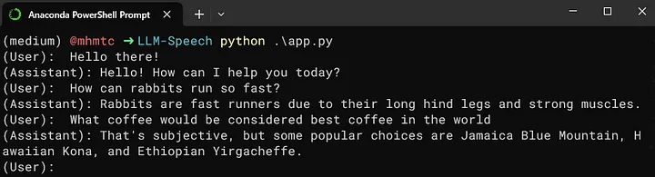
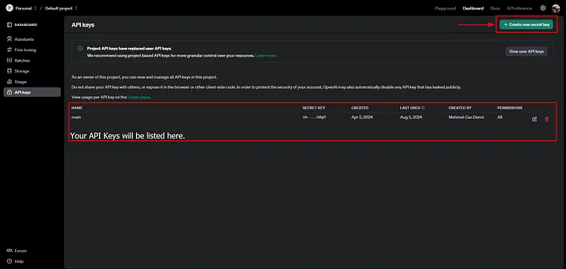
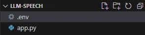
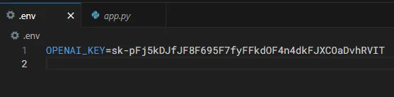

Your very own mini-Jarvis.

```
python app.py
```



# Intro

In this project, we will build a lightweight AI Agent application, with speech! With the newest updates from OpenAI Whisper, it is now INCREDIBLY easy to create your own Jarvis-like applications.

Before we start, make sure you have a VSCode or any kind of Python development environment. We will also use some specific libraries for this cool task. Let us begin!

### Libraries:

    1- OpenAI: pip install openai
    2- Dotenv: pip install python-dotenv
    3- Playsound: pip install playsound==1.2.2

Now since we will be using OpenAI APIs, we will require an API key. Let's create one by heading to https://platform.openai.com/api-keys.



After you create your API key, don’t forget to save it somewhere! You will only see it once. Also, keep in mind you will need to configure your payment settings.

Now, let's get back to our code.



I recommend using a “.env” file to keep API keys safe. It is extremely useful when pushing our code to GitHub or any other version control products.

After creating it, just paste your API key here. We will be just reading our API key from here as an environment variable.



Now return to the app.pyand import our libraries.

```
import os
import dotenv

dotenv.load_dotenv()
from openai import OpenAI
from playsound import playsound
import warnings

# Ignore DeprecationWarning
warnings.filterwarnings("ignore", category=DeprecationWarning)
```

Initialize OpenAI Client:

```
client = OpenAI(api_key=os.environ["OPENAI_KEY"])
```

Create a function to send queries to GPT:

```
def generate_completion(query):
    response = client.chat.completions.create(
        model="gpt-3.5-turbo",
        messages=[
            {
                "role": "system",
                "content": "You are a friendly assistant that speaks like a normal human. Try to give short answers instead of long and detailed ones.",
            },
            {"role": "user", "content": query},
        ],
        max_tokens=64,
    )  # this will return a "Completion" object

    text = response.choices[0].message.content  # get the text data from the created object

    return text
```

Create a function that will play the generated audio:

```
def generate_audio(text):
    speech_file_path = "speech.mp3"  # audio file path
    response = client.audio.speech.create(
        model="tts-1",
        voice="alloy",
        input=text,
    )  # creating the audio

    response.stream_to_file(speech_file_path)  # writing audio to file
    playsound("speech.mp3")  # playing the generated audio
    os.remove("speech.mp3")  # deleting the generated file afterwards
```

Now, it is time to run our mini-Jarvis!

```
if __name__ == "__main__":

    while True:
        print("(User):  ", end="")
        user_input = input()

        generated_text = generate_completion(user_input)
        print(f"(Assistant): {generated_text}")
        generate_audio(generated_text)
```

> $ python app.py


### Advanced improvements as a Homework:

    1-) A cool friendly User Interface. (e.g. Streamlit)
    2-) Threading! Playing audio and generating texts in parallel.

### Social Links

LinkedIn: https://www.linkedin.com/in/mehmet-can-demir <br>
Github: https://github.com/mcandemir <br>
Portfolio: https://mehmetcandemir.com <br>
Twitter: https://twitter.com/candemirai <br>
